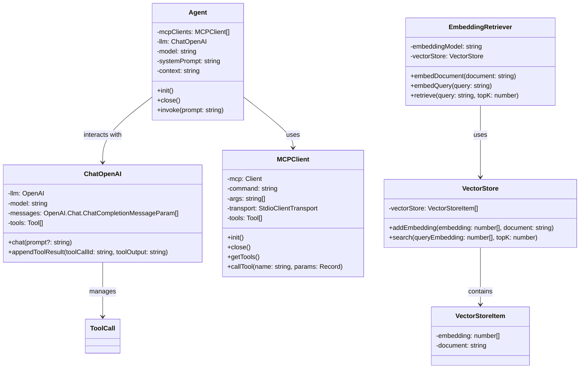
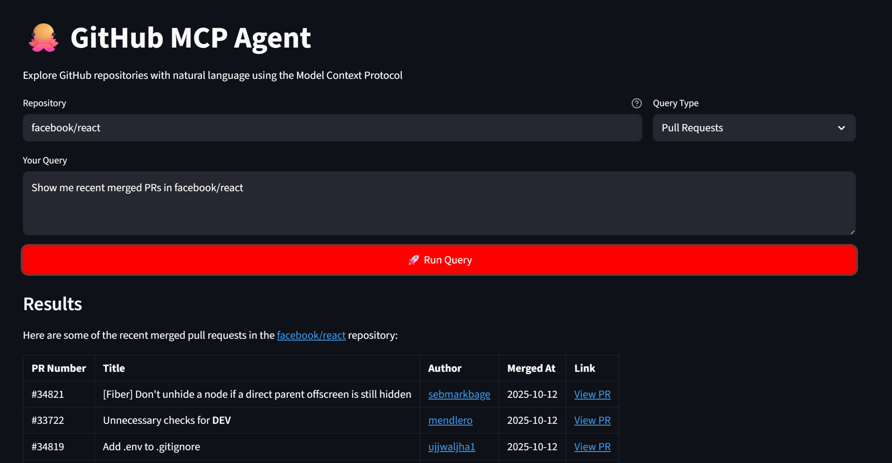

# ArgoMCP

<div align="center">

<!-- Keep these links. Translations will automatically update with the README. -->
[Deutsch](https://zdoc.app/de/BV003/ArgoMCP) | 
[English](https://zdoc.app/en/BV003/ArgoMCP) | 
[Español](https://zdoc.app/es/BV003/ArgoMCP) | 
[français](https://zdoc.app/fr/BV003/ArgoMCP) | 
[日本語](https://zdoc.app/ja/BV003/ArgoMCP) | 
[한국어](https://zdoc.app/ko/BV003/ArgoMCP) | 
[Português](https://zdoc.app/pt/BV003/ArgoMCP) | 
[Русский](https://zdoc.app/ru/BV003/ArgoMCP) | 
[中文](https://zdoc.app/zh/BV003/ArgoMCP)

</div>


### 🚀 Introduction

ArgoMCP demonstrates how Model Context Protocol (MCP) can be combined with intelligent agents to extend their capabilities beyond the core language model. By connecting agents to tools such as file systems, web fetchers, and memory modules, the project showcases how agents can retrieve, process, and generate knowledge in a modular and context-aware way.


### ✨ Features

MCP-Centric Design: The system is built around the Model Context Protocol (MCP), ensuring standardized communication and interoperability.


### 📂 Project Structure

```
.
├── LICENSE
├── README.md
├── examples
│   ├── demo1.py
│   ├── demo2.py
│   └── demo3.py
├── knowledge
│   ├── user_1.md
│   ├── user_10.md
│   ├── user_2.md
│   ├── user_3.md
│   ├── user_4.md
│   ├── user_5.md
│   ├── user_6.md
│   ├── user_7.md
│   ├── user_8.md
│   └── user_9.md
├── logs
├── output
│   └── antonette.md
├── requirements.txt
├── pyproject.toml
├── run.sh
├── src
│   ├── argomcp
│   │   ├── agent
│   │   │   └── Agent.py
│   │   ├── llm
│   │   │   ├── ChatDoubao.py
│   │   │   └─ ChatOpenAI.py
│   │   ├── mcp
│   │   │   └─── MCPClient.py
│   │   ├── rag
│   │   │   ├── EmbeddingRetriver.py
│   │   │   └─ VectorStore.py
│   │   └── utils
│   │       └── logTitle.py
```



### ⚡ Quick Start
Clone the Repository
```
git clone https://github.com/BV003/ArgoMCP.git
cd ArgoMCP
```
Create and Activate Virtual Environment. We recommend using conda for dependency management.
```
conda create -n argomcp python=3.10 -y
conda activate argomcp
```
Install Dependencies
```
pip install -r requirements.txt
pip install -e .
```
Create a .env file in the project root directory and add your API Keys (e.g., OpenAI or other LLM providers) You can also use other models, as long as you implement the corresponding class under /llm.
```
OPENAI_API_KEY=your_api_key_here  //openai
ARK_API_KEY=your_api_key_here //doubao
EMBEDDING_MODEL=all-MiniLM-L6-v2

githubtoken=your_api_key_here   //for demo2

NOTION_API_KEY=your_api_key_here    //for demo3
NOTION_PAGE_ID=your_page_id_here
```


### 🧪 Demo
#### Demo1

Use fileMCP to search the local knowledge/ directory (contains 10 .md user files), retrieve the content related to Chelsey Dietrich, generate a short bio + story, and save the result back to the repository as a Markdown file.

```
./run.sh
# or
python examples/demo1.py
```

The result will be placed at output/antonette.md

#### Demo2
- A web application interface for the GitHub MCP Agent has been implemented, allowing users to query GitHub repository information via natural language.


Make sure you have installed and started Docker before running.
```
streamlit run examples/demo2.py
```


#### Demo3
- A terminal-based interactive Notion assistant that directly manipulates Notion pages through MCP tools while using GPT to understand natural language commands and generate corresponding actions.

```
python examples/demo3.py
```
result
```
Notion MCP Agent is ready! Start chatting with your Notion pages.

Type 'exit' or 'quit' to end the conversation.

 🤖 You : what can you do
INFO Successfully created table 'agno_sessions'                                                                                                                                   
┏━ Message ━━━━━━━━━━━━━━━━━━━━━━━━━━━━━━━━━━━━━━━━━━━━━━━━━━━━━━━━━━━━━━━━━━━━━━━━━━━━━━━━━━━━━━━━━━━━━━━━━━━━━━━━━━━━━━━━━━━━━━━━━━━━━━━━━━━━━━━━━━━━━━━━━━━━━━━━━━━━━━━━━━━━━━┓
┃                                                                                                                                                                                ┃
┃ what can you do                                                                                                                                                                ┃
┃                                                                                                                                                                                ┃
┗━━━━━━━━━━━━━━━━━━━━━━━━━━━━━━━━━━━━━━━━━━━━━━━━━━━━━━━━━━━━━━━━━━━━━━━━━━━━━━━━━━━━━━━━━━━━━━━━━━━━━━━━━━━━━━━━━━━━━━━━━━━━━━━━━━━━━━━━━━━━━━━━━━━━━━━━━━━━━━━━━━━━━━━━━━━━━━━━┛
┏━ Response (5.9s) ━━━━━━━━━━━━━━━━━━━━━━━━━━━━━━━━━━━━━━━━━━━━━━━━━━━━━━━━━━━━━━━━━━━━━━━━━━━━━━━━━━━━━━━━━━━━━━━━━━━━━━━━━━━━━━━━━━━━━━━━━━━━━━━━━━━━━━━━━━━━━━━━━━━━━━━━━━━━━━┓
┃                                                                                                                                                                                ┃
┃ I can help you interact with your Notion pages in various ways. Here are some of the things I can do:                                                                          ┃
┃                                                                                                                                                                                ┃
┃  1 Read Page Content: Retrieve and display the content of your Notion pages.                                                                                                   ┃
┃  2 Search Information: Search for specific information within your Notion workspace.                                                                                           ┃
┃  3 Add or Update Content: Insert new content or update existing content, including creating lists, tables, and other Notion blocks.                                            ┃
┃  4 Page Management: Create new pages, update page properties, and manage page icons and covers.                                                                                ┃
┃  5 Block Management: Retrieve, update, or delete specific blocks within a page.                                                                                                ┃
┃  6 Database Management: Query, update, or retrieve database information.                                                                                                       ┃
┃  7 Commenting: Add comments to specific blocks or pages and retrieve existing comments.                                                                                        ┃
┃  8 Explain Page Structure: Provide information on how your page is structured.                                                                                                 ┃
┃                                                                                                                                                                                ┃
┃ If you have any specific tasks you'd like assistance with, feel free to ask!                                                                                                   ┃
┃                                                                                                                                                                                ┃
┗━━━━━━━━━━━━━━━━━━━━━━━━━━━━━━━━━━━━━━━━━━━━━━━━━━━━━━━━━━━━━━━━━━━━━━━━━━━━━━━━━━━━━━━━━━━━━━━━━━━━━━━━━━━━━━━━━━━━━━━━━━━━━━━━━━━━━━━━━━━━━━━━━━━━━━━━━━━━━━━━━━━━━━━━━━━━━━━━┛

 🤖 You : Explain Page Structure          
┏━ Message ━━━━━━━━━━━━━━━━━━━━━━━━━━━━━━━━━━━━━━━━━━━━━━━━━━━━━━━━━━━━━━━━━━━━━━━━━━━━━━━━━━━━━━━━━━━━━━━━━━━━━━━━━━━━━━━━━━━━━━━━━━━━━━━━━━━━━━━━━━━━━━━━━━━━━━━━━━━━━━━━━━━━━━┓
┃                                                                                                                                                                                ┃
┃ Explain Page Structure                                                                                                                                                         ┃
┃                                                                                                                                                                                ┃
┗━━━━━━━━━━━━━━━━━━━━━━━━━━━━━━━━━━━━━━━━━━━━━━━━━━━━━━━━━━━━━━━━━━━━━━━━━━━━━━━━━━━━━━━━━━━━━━━━━━━━━━━━━━━━━━━━━━━━━━━━━━━━━━━━━━━━━━━━━━━━━━━━━━━━━━━━━━━━━━━━━━━━━━━━━━━━━━━━┛
┏━ Tool Calls ━━━━━━━━━━━━━━━━━━━━━━━━━━━━━━━━━━━━━━━━━━━━━━━━━━━━━━━━━━━━━━━━━━━━━━━━━━━━━━━━━━━━━━━━━━━━━━━━━━━━━━━━━━━━━━━━━━━━━━━━━━━━━━━━━━━━━━━━━━━━━━━━━━━━━━━━━━━━━━━━━━━┓
┃                                                                                                                                                                                ┃
┃ • API-retrieve-a-page(page_id=200fe1fbb5e7800a93d8fdea8c4013c6)                                                                                                                ┃
┃                                                                                                                                                                                ┃
┗━━━━━━━━━━━━━━━━━━━━━━━━━━━━━━━━━━━━━━━━━━━━━━━━━━━━━━━━━━━━━━━━━━━━━━━━━━━━━━━━━━━━━━━━━━━━━━━━━━━━━━━━━━━━━━━━━━━━━━━━━━━━━━━━━━━━━━━━━━━━━━━━━━━━━━━━━━━━━━━━━━━━━━━━━━━━━━━━┛
┏━ Response (9.8s) ━━━━━━━━━━━━━━━━━━━━━━━━━━━━━━━━━━━━━━━━━━━━━━━━━━━━━━━━━━━━━━━━━━━━━━━━━━━━━━━━━━━━━━━━━━━━━━━━━━━━━━━━━━━━━━━━━━━━━━━━━━━━━━━━━━━━━━━━━━━━━━━━━━━━━━━━━━━━━━┓
┃                                                                                                                                                                                ┃
┃ The structure of a Notion page involves several elements that help organize and display content effectively. Here's a breakdown of the page structure based on the current     ┃
┃ page with ID 2:                                                                                                                                 ┃
┃                                                                                                                                                                                ┃
┃  1 Basic Information:                                                                                                                                                          ┃
┃     • Page ID: Unique identifier for the page.                                                                                                                                 ┃
┃     • Created Time: When the page was created.                                                                                                                                 ┃
┃     • Last Edited Time: The most recent time the page was modified.                                                                                                            ┃
┃  2 User Information:                                                                                                                                                           ┃
┃     • Created By: The user who created the page.                                                                                                                               ┃
┃     • Last Edited By: The user who last edited the page.                                                                                                                       ┃
┃  3 Visual Elements:                                                                                                                                                            ┃
┃     • Icon: An emoji used as an icon, in this case, "🔥".                                                                                                                      ┃
┃     • Cover Image: No cover image has been set for this page.                                                                                                                  ┃
┃     • Parent Type: This page is part of the overall workspace.                                                                                                                 ┃
┃  4 Properties:                                                                                                                                                                 ┃
┃     • Title: The title of the page, which is "身体".                                                                                                                   ┃
┃  5 URLs:                                                                                                                                                                       ┃
┃     • Page URL: The direct link to access the page is here.                                                                                                                    ┃
┃                                                                                                                                                                                ┃
┃ Each page can include content blocks like text, images, tables, lists, and more. These blocks can be arranged and customized to suit the needs and preferences of the user.    ┃
┃ You can further append, update, and delete content as needed to organize your information effectively.                                                                         ┃
┃                                                                                                                                                                                ┃
┃ Is there anything specific you would like to explore or modify in this page?                                                                                                   ┃
┃                                                                                                                                                                                ┃
┗━━━━━━━━━━━━━━━━━━━━━━━━━━━━━━━━━━━━━━━━━━━━━━━━━━━━━━━━━━━━━━━━━━━━━━━━━━━━━━━━━━━━━━━━━━━━━━━━━━━━━━━━━━━━━━━━━━━━━━━━━━━━━━━━━━━━━━━━━━━━━━━━━━━━━━━━━━━━━━━━━━━━━━━━━━━━━━━━┛
```
### 🤝 Contributing

We welcome contributions! Whether it's:

- Bug fixes
- New features
- Documentation improvements
- Translations

Please:  
- Check existing issues first  
- Open an issue to discuss major changes  
- Submit PRs with clear descriptions  


### 🔥 For Beginners

**This is an independent educational project, designed for learning and practice.**

If you are new to open source:
- Don’t worry! This project is meant to be beginner-friendly 
- You can start small (update README, add comments, fix small bugs) 
- You can build on top of this project, customize it, and even use it as part of your course assignments or personal practice projects.🤪


### 🎉 License
This project is licensed under the MIT License - see the [LICENSE](LICENSE) file for details.
