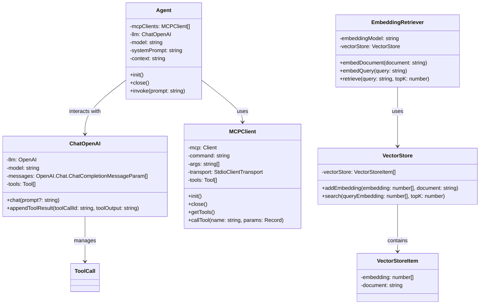

# ArgoMCP

<div align="center">

<!-- Keep these links. Translations will automatically update with the README. -->
[Deutsch](https://zdoc.app/de/BV003/ArgoMCP) | 
[English](https://zdoc.app/en/BV003/ArgoMCP) | 
[Español](https://zdoc.app/es/BV003/ArgoMCP) | 
[français](https://zdoc.app/fr/BV003/ArgoMCP) | 
[日本語](https://zdoc.app/ja/BV003/ArgoMCP) | 
[한국어](https://zdoc.app/ko/BV003/ArgoMCP) | 
[Português](https://zdoc.app/pt/BV003/ArgoMCP) | 
[Русский](https://zdoc.app/ru/BV003/ArgoMCP) | 
[中文](https://zdoc.app/zh/BV003/ArgoMCP)

</div>


### 🚀 Introduction

ArgoMCP demonstrates how Model Context Protocol (MCP) can be combined with intelligent agents to extend their capabilities beyond the core language model. By connecting agents to tools such as file systems, web fetchers, and memory modules, the project showcases how agents can retrieve, process, and generate knowledge in a modular and context-aware way.


### ✨ Features

MCP-Centric Design: The system is built around the Model Context Protocol (MCP), ensuring standardized communication and interoperability.


### 📂 Project Structure

```
.
├── LICENSE
├── README.md
├── examples
│   ├── demo1.py
│   ├── demo2.py
│   └── demo3.py
├── knowledge
│   ├── user_1.md
│   ├── user_10.md
│   ├── user_2.md
│   ├── user_3.md
│   ├── user_4.md
│   ├── user_5.md
│   ├── user_6.md
│   ├── user_7.md
│   ├── user_8.md
│   └── user_9.md
├── logs
├── output
│   └── antonette.md
├── requirements.txt
├── pyproject.toml
├── run.sh
├── src
│   ├── argomcp
│   │   ├── agent
│   │   │   └── Agent.py
│   │   ├── llm
│   │   │   ├── ChatDoubao.py
│   │   │   └─ ChatOpenAI.py
│   │   ├── mcp
│   │   │   └─── MCPClient.py
│   │   ├── rag
│   │   │   ├── EmbeddingRetriver.py
│   │   │   └─ VectorStore.py
│   │   └── utils
│   │       └── logTitle.py
```



### ⚡ Quick Start
Clone the Repository
```
git clone https://github.com/BV003/ArgoMCP.git
cd ArgoMCP
```
Create and Activate Virtual Environment. We recommend using conda for dependency management.
```
conda create -n argomcp python=3.10 -y
conda activate argomcp
```
Install Dependencies
```
pip install -r requirements.txt
pip install -e .
```
Create a .env file in the project root directory and add your API Keys (e.g., OpenAI or other LLM providers) You can also use other models, as long as you implement the corresponding class under /llm.
```
OPENAI_API_KEY=your_api_key_here  //openai
ARK_API_KEY=your_api_key_here //doubao
EMBEDDING_MODEL=all-MiniLM-L6-v2

githubtoken=your_api_key_here   //for demo2

NOTION_API_KEY=your_api_key_here    //for demo3
NOTION_PAGE_ID=your_page_id_here
```


### 🧪 Demo
#### Demo1

Use fileMCP to search the local knowledge/ directory (contains 10 .md user files), retrieve the content related to Chelsey Dietrich, generate a short bio + story, and save the result back to the repository as a Markdown file.

```
./run.sh
# or
python examples/demo1.py
```

The result will be placed at output/antonette.md

#### Demo2
- A web application interface for the GitHub MCP Agent has been implemented, allowing users to query GitHub repository information via natural language.


Make sure you have installed and started Docker before running.
```
streamlit run examples/demo2.py
```

#### Demo3
- 

```
python examples/demo3.py
```
### 🤝 Contributing

We welcome contributions! Whether it's:

- Bug fixes
- New features
- Documentation improvements
- Translations

Please:  
- Check existing issues first  
- Open an issue to discuss major changes  
- Submit PRs with clear descriptions  


### 🔥 For Beginners

**This is an independent educational project, designed for learning and practice.**

If you are new to open source:
- Don’t worry! This project is meant to be beginner-friendly 
- You can start small (update README, add comments, fix small bugs) 
- You can build on top of this project, customize it, and even use it as part of your course assignments or personal practice projects.🤪


### 🎉 License
This project is licensed under the MIT License - see the [LICENSE](LICENSE) file for details.
